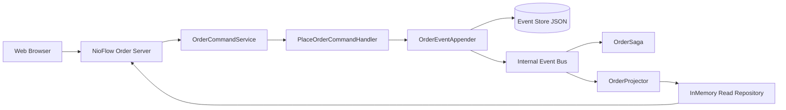

# Evora | Event-Sourced Order Management System

Evora is a high-fidelity, event-sourced Order Management System (OMS) built on the **NioFlow** micro-framework. It demonstrates advanced distributed systems patterns including **CQRS**, **Saga Orchestration**, **Event Sourcing**, and **Idempotent Command Handling** within a unified, high-performance runtime.

## 🚀 Key Features

- **Event Sourcing**: Immutable ledger-based state management with full replay support.
- **Saga Orchestration**: Complex multi-stage transaction coordination with automated compensation (Self-Healing).
- **Premium Web Dashboard**: High-fidelity UI for real-time order tracking and lifecycle monitoring.
- **Admin Command Center**: Global telemetry, revenue metrics, and deep-trace event analysis.
- **Deterministic Simulation**: Built-in scenarios to test failure paths like `STOCK_OUT`, `PAYMENT_DECLINED`, and `SHIPPING_ERROR`.
- **NioFlow Integration**: Powered by a lightweight, high-concurrency Java micro-framework.

## 🛠️ Architecture

Evora separates the **Write Side** (Command handling & Event Appending) from the **Read Side** (Projections & Dashboards), ensuring maximum scalability and observability.



## 🖥️ Dashboard & Observability

Evora provides two specialized portals for system management:

- **Customer Portal**: Create orders and track their real-time execution via a high-fidelity event timeline.
- **Admin Portal**: Monitor global system health, success rates, and perform "Deep Traces" into the raw JSON event stream.

### Event Tracing
Every state transition is visible as a raw JSON log, allowing developers to see exactly how Aggregate IDs, Idempotency Keys, and Versioning work in a production-grade system.

## 🚦 Getting Started

### Prerequisites
- **Java 17** or later
- **Maven** (for building)

### Launching the System
We provide a unified launch script that handles compilation and starts the NioFlow server.

```powershell
.\launch-evora.ps1
```

Once running, access the portals at:
- **User Dashboard**: [http://localhost:8080/index.html](http://localhost:8080/index.html)
- **Admin Panel**: [http://localhost:8080/admin.html](http://localhost:8080/admin.html)

## 🧪 Simulation Scenarios
You can trigger deterministic failures during order creation to observe the Saga's compensation logic:
- **STOCK_OUT**: Triggers inventory failure.
- **PAYMENT_DECLINED**: Triggers payment failure and inventory rollback.
- **SHIPPING_ERROR**: Triggers shipping failure, payment refund, and inventory release.

## 📁 Project Structure
- `com.evora.domain`: Aggregate roots and event definitions.
- `com.evora.saga`: Orchestration logic and simulated microservices.
- `com.evora.projection`: CQRS projection and read-model state.
- `com.evora.api.http`: NioFlow server and REST endpoints.
- `static/`: High-fidelity dashboard assets (CSS/JS/HTML).

---
*Built with ❤️ for High-Performance Distributed Systems.*