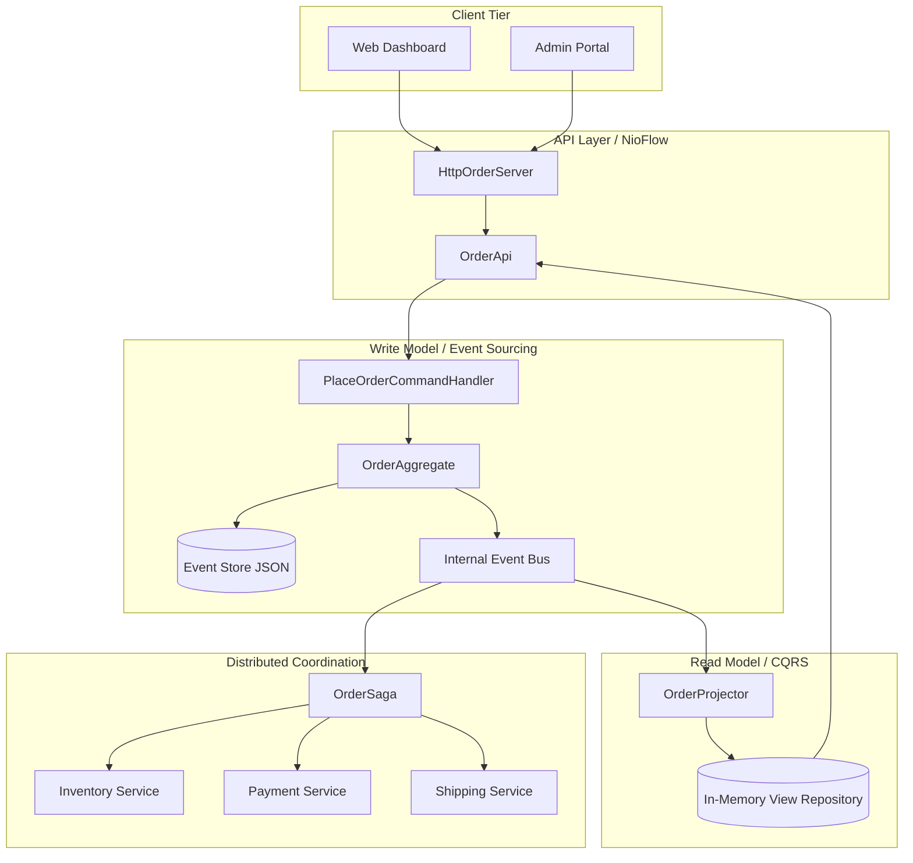
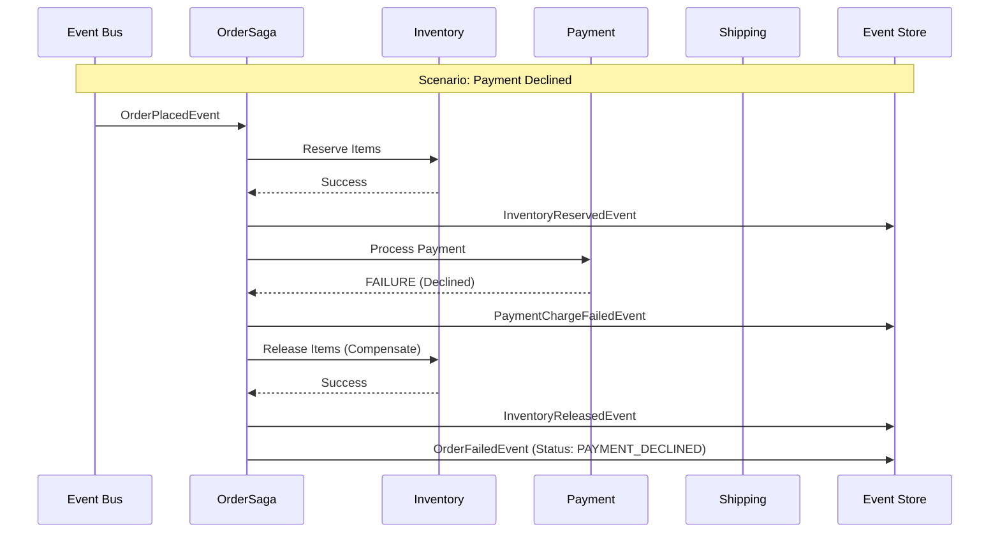

# Evora | Event-Sourced Order Management System

Evora is a high-fidelity, event-sourced Order Management System (OMS) built on the NioFlow micro-framework. It demonstrates advanced distributed systems patterns including CQRS, Saga Orchestration, Event Sourcing, and Idempotent Command Handling within a unified, high-performance runtime.

## System Architecture

Evora utilizes a strict separation between command processing and query projections. The following diagram illustrates the component interaction and data flow across the system.



## Saga Execution Workflow

The transaction lifecycle is coordinated via a Saga. If any stage in the happy path fails, the system executes compensation events to maintain consistency across simulated downstream services.



## Dashboard and Observability

Evora provides specialized portals for system management:

* **Customer Portal**: Create orders and track real-time execution via a high-fidelity event timeline.
* **Admin Portal**: Monitor global system health, success rates, and perform deep traces into raw JSON event streams.

### Event Tracing
Every state transition is visible as a raw JSON log, allowing for inspection of Aggregate IDs, Idempotency Keys, and Versioning data as it is processed by the system.

## Getting Started

### Prerequisites
* Java 17 or later
* Maven

### Launching the System
The provided launch script handles compilation and starts the NioFlow server.

```powershell
.\launch-evora.ps1
```

Once running, the portals are accessible at:
* **User Dashboard**: http://localhost:8080/index.html
* **Admin Panel**: http://localhost:8080/admin.html

## Simulation Scenarios
Deterministic failures can be triggered during order creation to observe Saga compensation logic:
* **STOCK_OUT**: Triggers inventory failure.
* **PAYMENT_DECLINED**: Triggers payment failure and inventory rollback.
* **SHIPPING_ERROR**: Triggers shipping failure, payment refund, and inventory release.

## Project Structure
* `com.evora.domain`: Aggregate roots and event definitions.
* `com.evora.saga`: Orchestration logic and simulated microservices.
* `com.evora.projection`: CQRS projection and read-model state.
* `com.evora.api.http`: NioFlow server and REST endpoints.
* `src/main/resources/static`: Dashboard assets including CSS, JavaScript, and HTML.

---
Built for High-Performance Distributed Systems.