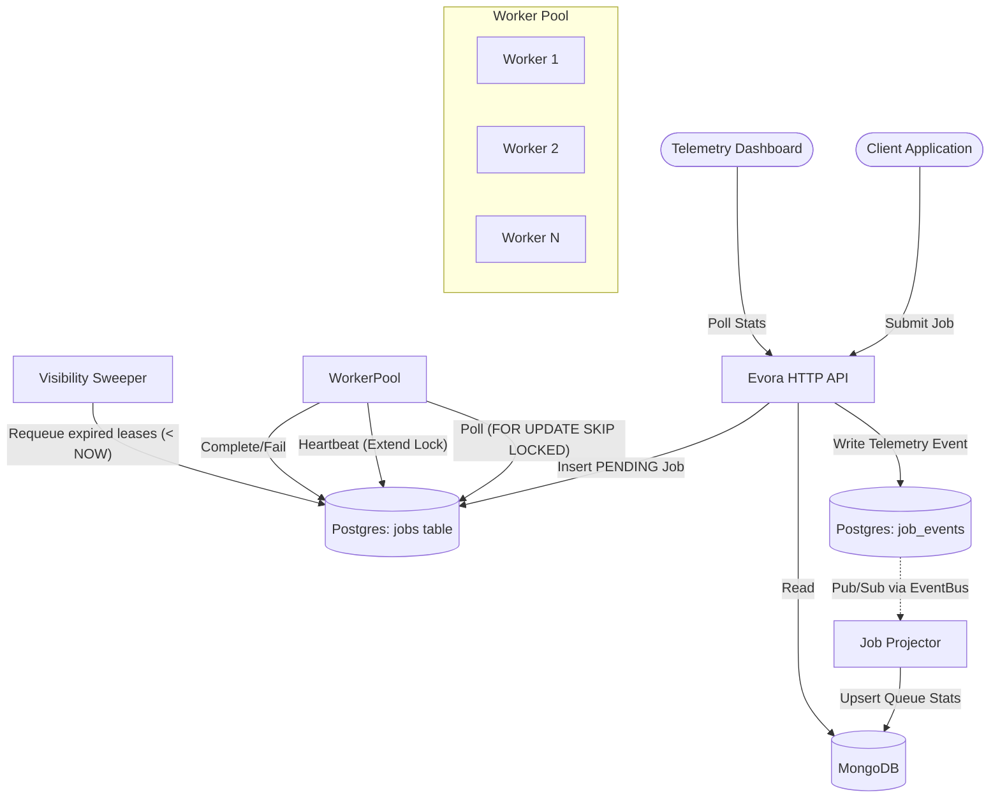
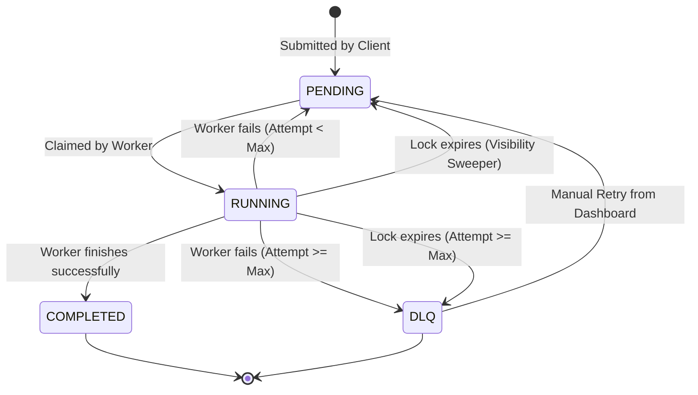
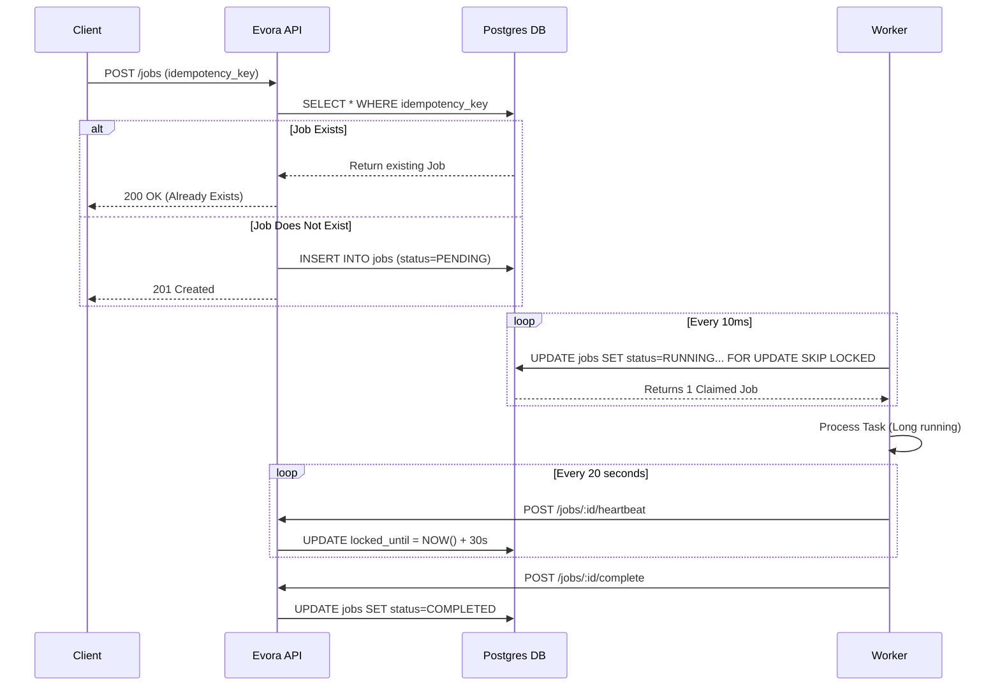

# Evora - Job Queue

Evora is a robust distributed job queue system built on top of Postgres with exactly-once idempotency guarantees and scalable worker management.

## System Architecture



## Job Lifecycle (State Machine)

This diagram shows how a job transitions through its states within Evora.



## Queue Processing Sequence

This sequence diagram illustrates the lifecycle of a single job, including idempotency checks and worker processing.



## Exactly-Once Idempotency & Locking

Our core mechanic for safely claiming jobs across multiple concurrent workers without external queues (like RabbitMQ or Redis) relies on Postgres's native `FOR UPDATE SKIP LOCKED`.

```sql
UPDATE jobs
SET status        = 'RUNNING',
    worker_id     = ?,
    locked_until  = NOW() + (? || ' seconds')::INTERVAL,
    attempt_count = attempt_count + 1
WHERE id = (
    SELECT id FROM jobs
    WHERE status       = 'PENDING'
      AND queue        = ?
      AND scheduled_at <= NOW()
    ORDER BY priority ASC, scheduled_at ASC
    FOR UPDATE SKIP LOCKED
    LIMIT 1
)
RETURNING *
```

**Why this guarantees exactly-once processing:**
1. **Idempotent Submission:** When a job is submitted, we first check the `idempotency_key`. If it exists, we return the existing job. This prevents the same operation from being queued multiple times.
2. **Atomic Claiming:** `FOR UPDATE SKIP LOCKED` allows multiple workers to poll the table simultaneously. Instead of blocking each other waiting for a row lock, they instantly skip over rows already locked by other workers and grab the next available pending job.
3. **Visibility Timeouts:** Rather than assuming a worker completed the job, we give them a "lease" (`locked_until`). If the worker crashes before completion, the lease expires. The `VisibilityTimeoutSweeper` will then requeue the job automatically.

## The Visibility Timeout Flow

1. A worker polls and claims a job. The job status becomes `RUNNING` and a `locked_until` timestamp is set (e.g., 30 seconds into the future).
2. The worker processes the job. If processing is slow, the worker periodically sends a heartbeat to extend the `locked_until` timestamp.
3. If the worker crashes or hangs, it stops sending heartbeats.
4. The `VisibilityTimeoutSweeper` runs periodically (e.g., every 10 seconds), finding jobs where `status = 'RUNNING'` and `locked_until < NOW()`.
5. The sweeper resets the job to `PENDING` (requeuing it) and increments the attempt count. If the maximum attempt count is reached, it moves the job to the Dead Letter Queue (DLQ).

## Key Design Decisions

1. **Postgres as a Queue:** While dedicated message brokers are standard, using Postgres simplifies our operational overhead. With `SKIP LOCKED`, Postgres is highly capable of acting as a high-throughput queue while giving us transactional guarantees across business data and queue state.
2. **Pull vs Push:** Workers actively poll the queue instead of the system pushing to them. This inherently provides backpressure—workers only take what they can handle, preventing overwhelming down-stream systems during traffic spikes.
3. **Eventual Consistency Telemetry:** We separate operational queuing (Postgres) from telemetry (MongoDB). Domain events like `JobCompletedEvent` are published and projected into Mongo. This offloads expensive aggregation queries from our core Postgres database, ensuring queue latency stays minimal.

## Setup & Running

Start the supporting infrastructure:
```bash
docker-compose up -d
```

Run the application:
```bash
mvn clean compile exec:java -Dexec.mainClass="com.evora.EvoraApplication"
```

## Dashboards

- [Submit Job Dashboard](http://localhost:8080/index.html)
- [Telemetry & Admin](http://localhost:8080/admin.html)