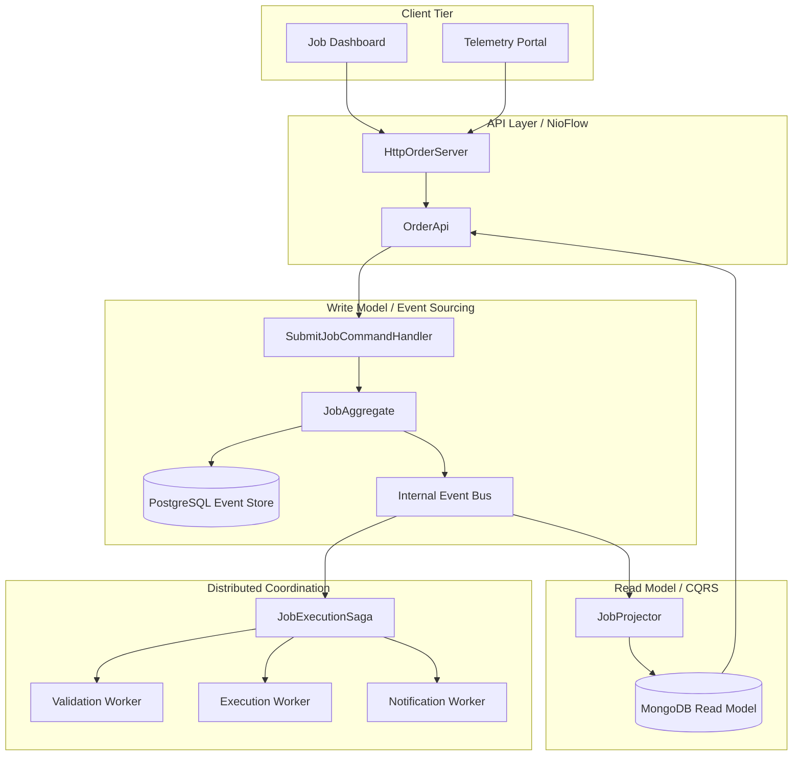
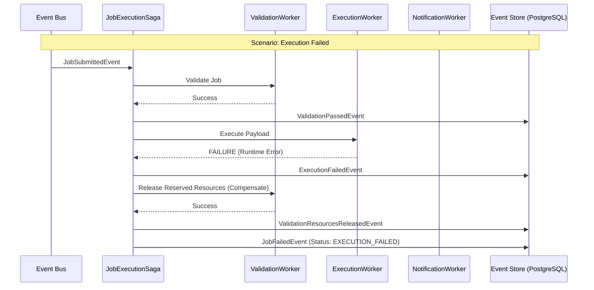

# Evora | Distributed Event-Sourced Job Queue

Evora is a high-fidelity, distributed Job Queue system built on the NioFlow micro-framework. It demonstrates advanced distributed systems patterns including CQRS, Saga Orchestration, Event Sourcing, and Idempotent Command Handling within a unified, high-performance runtime.

## System Architecture

Evora utilizes a strict separation between job submission (commands) and job status tracking (query projections). The following diagram illustrates the component interaction and data flow across the system, utilizing a Polyglot Persistence strategy to optimize for both write integrity and read performance.



## Saga Execution Workflow

The job execution lifecycle is coordinated via a Saga. If any worker stage in the happy path fails, the system executes compensation logic to maintain consistency across distributed resources.



## Polyglot Persistence Strategy

The system utilizes specialized storage engines for different operational requirements:

* **PostgreSQL (Write-Side)**: Used as the primary Event Store. It provides ACID compliance and transactional consistency to ensure that job lifecycle events are recorded with absolute integrity.
* **MongoDB (Read-Side)**: Used for the CQRS Read Model. It stores denormalized job views as documents, allowing for high-performance, complex queries and status filtering without imposing load on the transactional engine.

## Dashboard and Observability

Evora provides specialized portals for job management:

* **User Dashboard**: Submit jobs and track real-time execution via a high-fidelity event timeline.
* **Admin Panel**: Monitor global throughput, failure rates, and perform deep traces into raw JSON event streams.

### Event Tracing
Every state transition is visible as a raw JSON log, allowing for inspection of Aggregate IDs, Idempotency Keys, and Versioning data as it is processed by the system.

## Getting Started

### Prerequisites
* Java 17 or later
* Maven
* Docker Desktop (required for PostgreSQL and MongoDB infrastructure)

### Infrastructure Setup
Launch the persistent storage layer using the provided Docker configuration:

```bash
docker-compose up -d
```

### Launching the System
The provided launch scripts handle compilation and start the NioFlow server automatically.

**Windows (PowerShell):**
```powershell
.\launch-evora.ps1
```

**Linux / macOS (Bash):**
```bash
chmod +x launch-evora.sh
./launch-evora.sh
```

Once running, the portals are accessible at:
* **User Dashboard**: http://localhost:8080/index.html
* **Admin Panel**: http://localhost:8080/admin.html

## Simulation Scenarios
Deterministic failures can be triggered during job submission to observe Saga compensation logic:

* **VALIDATION_FAILED**: Triggers validation worker failure.
* **EXECUTION_FAILED**: Triggers execution worker failure and validation rollback.
* **NOTIFICATION_FAILED**: Triggers notification worker failure, execution rollback, and validation release.

## Project Structure
* `com.evora.domain`: Aggregate roots and state machine.
* `com.evora.saga`: Orchestration logic and distributed workers.
* `com.evora.projection`: CQRS projection and MongoDB read-model repository.
* `com.evora.store`: PostgreSQL event store implementation.
* `com.evora.api.http`: NioFlow server and REST endpoints.
* `src/main/resources/static`: Dashboard assets including CSS, JavaScript, and HTML.

---
Built for High-Performance Distributed Systems.