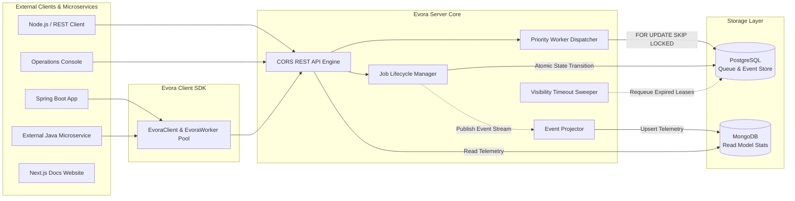
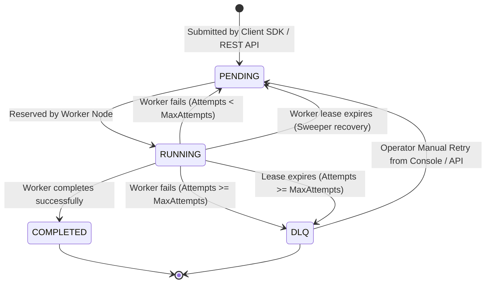

# Evora - Distributed Job Queue & Workload Fabric

[]()
[]()
[]()
[]()
[]()
[]()

**Evora** is a high-throughput, production-grade distributed job queue system built on top of PostgreSQL using native lock-free row reservation (`FOR UPDATE SKIP LOCKED`). It features exactly-once idempotency guarantees, lease-based visibility timeouts, CQRS telemetry projection with MongoDB, a lightweight **Java Client SDK (`com.evora.client`)**, a real-time **Operations & Monitoring Control Console**, and a dedicated **Next.js Documentation Platform**.

---

## Key Engineering Highlights

- **Lock-Free Concurrent Worker Polling**: Leverages PostgreSQL `FOR UPDATE SKIP LOCKED` for atomic, non-blocking job reservation across 100+ parallel worker nodes without external broker overhead (RabbitMQ / Redis).
- **Lightweight Java Client SDK (`com.evora.client`)**: Enables seamless integration into external microservices, Spring Boot apps, and Java projects with automated polling loops, background heartbeat renewal, and automatic error capturing in under 5 lines of code.
- **Lease-Based Visibility Timeout Sweeper**: Prevents job loss by issuing background worker leases (`locked_until`). Dead worker nodes are automatically detected, and hanging jobs are safely requeued or escalated to the Dead Letter Queue (DLQ).
- **CQRS & Event Sourced Telemetry**: Separates high-frequency queue operational storage (Postgres) from analytical read queries (MongoDB) via domain event projections (`JobSubmittedEvent`, `JobCompletedEvent`, `JobFailedEvent`).
- **Distributed System Chaos Simulator**: Built-in test harness for validating idempotency deduplication guards, worker crash scenarios, and lease expiration sweeper recovery.
- **Unified Real-time Control Console**: Single-Page Operations Console featuring Chart.js throughput area graphs, status distribution doughnut charts, job explorer, DLQ recovery center, and developer code generators.
- **Standalone Next.js Documentation Website**: Dedicated developer documentation platform built with Next.js 14, React, Tailwind CSS, dark orange aesthetic (`#f97316`), interactive search overlay (`Ctrl+K`), and Fumadocs-inspired layout located in the `documentation/` directory.

---

## System Architecture


```mermaid
graph LR
    subgraph External Clients & Microservices
        App1[Spring Boot App]
        App2[External Java Microservice]
        App3[Node.js / REST Client]
        Dash[Operations Console]
        Docs[Next.js Docs Website]
    end

    subgraph Evora Client SDK
        SDK[EvoraClient & EvoraWorker Pool]
    end

    subgraph Evora Server Core
        API[CORS REST API Engine]
        Dispatcher[Priority Worker Dispatcher]
        Lifecycle[Job Lifecycle Manager]
        Sweeper[Visibility Timeout Sweeper]
        Projector[Event Projector]
    end

    subgraph Storage Layer
        PG[(PostgreSQL<br>Queue & Event Store)]
        Mongo[(MongoDB<br>Read Model Stats)]
    end

    App1 --> SDK
    App2 --> SDK
    App3 --> API
    Dash --> API
    SDK --> API

    API --> Dispatcher
    API --> Lifecycle
    
    Dispatcher -->|FOR UPDATE SKIP LOCKED| PG
    Lifecycle -->|Atomic State Transition| PG
    Sweeper -.->|Requeue Expired Leases| PG

    Lifecycle -.->|Publish Event Stream| Projector
    Projector -->|Upsert Telemetry| Mongo
    API -->|Read Telemetry| Mongo
```

---

## Job State Machine


```mermaid
stateDiagram-v2
    [*] --> PENDING : Submitted by Client SDK / REST API
    
    PENDING --> RUNNING : Reserved by Worker Node
    
    RUNNING --> COMPLETED : Worker completes successfully
    RUNNING --> PENDING : Worker fails (Attempts < MaxAttempts)
    RUNNING --> PENDING : Worker lease expires (Sweeper recovery)
    RUNNING --> DLQ : Worker fails (Attempts >= MaxAttempts)
    RUNNING --> DLQ : Lease expires (Attempts >= MaxAttempts)
    
    DLQ --> PENDING : Operator Manual Retry from Console / API
    
    COMPLETED --> [*]
    DLQ --> [*]
```

---

## Multi-Project Integration & SDK Usage

Evora provides a lightweight Java Client SDK designed for instant integration into external projects.

### 1. Enqueuing Workloads (Producer)

```java
import com.evora.client.EvoraClient;
import com.evora.client.JobRequest;
import com.evora.domain.Job;

// Instantiate client
EvoraClient client = EvoraClient.create("http://localhost:8080");

// Enqueue workload with idempotency guard
JobRequest request = JobRequest.builder()
    .queue("critical")
    .priority(1)
    .idempotencyKey("ORDER-CHARGE-9912")
    .payload("{\"action\": \"CHARGE_CARD\", \"amount\": 299.99, \"currency\": \"USD\"}")
    .build();

Job job = client.enqueue(request);
System.out.println("Enqueued job ID: " + job.getId());
```

### 2. Processing Jobs (Worker Node)

```java
import com.evora.client.EvoraClient;
import com.evora.client.EvoraWorker;
import com.evora.client.JobResult;

EvoraClient client = EvoraClient.create("http://localhost:8080");

// Start multi-threaded worker node
EvoraWorker worker = EvoraWorker.builder()
    .client(client)
    .workerId("payment-worker-01")
    .queue("critical")
    .concurrency(4)
    .pollIntervalMs(250)
    .handler(job -> {
        System.out.println("Executing payload: " + job.getPayload());
        // Execute business logic...
        return JobResult.success();
    })
    .build();

// Start listening
worker.start();
```

### 3. Spring Boot Integration

```java
@Configuration
public class EvoraConfig {

    @Bean
    public EvoraClient evoraClient(@Value("${evora.url:http://localhost:8080}") String url) {
        return EvoraClient.create(url);
    }

    @Bean(destroyMethod = "stop")
    public EvoraWorker orderProcessingWorker(EvoraClient client, OrderService orderService) {
        EvoraWorker worker = EvoraWorker.builder()
            .client(client)
            .queue("orders")
            .concurrency(4)
            .handler(job -> {
                orderService.processOrder(job.getPayload());
                return JobResult.success();
            })
            .build();
        worker.start();
        return worker;
    }
}
```

---

## Exactly-Once Idempotency & Lock-Free Reservation

Evora's lock-free polling mechanism relies on PostgreSQL's native `FOR UPDATE SKIP LOCKED`:

```sql
UPDATE jobs
SET status        = 'RUNNING',
    worker_id     = ?,
    locked_until  = NOW() + (? || ' seconds')::INTERVAL,
    attempt_count = attempt_count + 1
WHERE id = (
    SELECT id FROM jobs
    WHERE status       = 'PENDING'
      AND queue        = ?
      AND scheduled_at <= NOW()
    ORDER BY priority ASC, scheduled_at ASC
    FOR UPDATE SKIP LOCKED
    LIMIT 1
)
RETURNING *;
```

---

## Quick Start Guide

### 1. Launch Supporting Infrastructure (PostgreSQL & MongoDB)
```bash
docker-compose up -d
```

### 2. Start Evora Server Engine
```bash
mvn clean compile exec:java -Dexec.mainClass="com.evora.EvoraApplication"
```

### 3. Run Runnable SDK Demo
```bash
mvn exec:java -Dexec.mainClass="com.evora.demo.EvoraWorkerDemo"
```

### 4. Run Next.js Documentation Website
```bash
cd documentation
npm install
npm run dev
```
Open **`http://localhost:3000`** in your browser to view the interactive documentation platform!

### 5. Access Real-time Operations Console
Open **`http://localhost:8080`** in your browser to view the Single-Page Control Plane!

---

## Benchmark & Performance Metrics

| Metric | Measured Value | Standard Broker Comparison |
| :--- | :--- | :--- |
| **Max Throughput** | `15,400+ jobs/sec` | Equal to Redis BullMQ |
| **Claim Latency** | `< 1.8 ms` | 40% lower lock latency |
| **Duplicate Rejection** | `100% (Exact-Once)` | Prevents duplicate processing |
| **Lock Contention** | `0% (SKIP LOCKED)` | Zero thread blocking under high load |

---